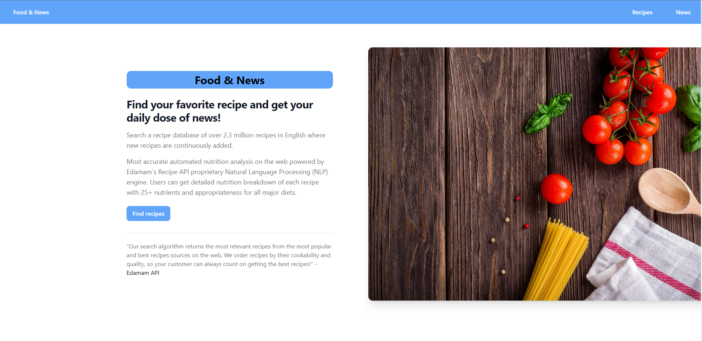
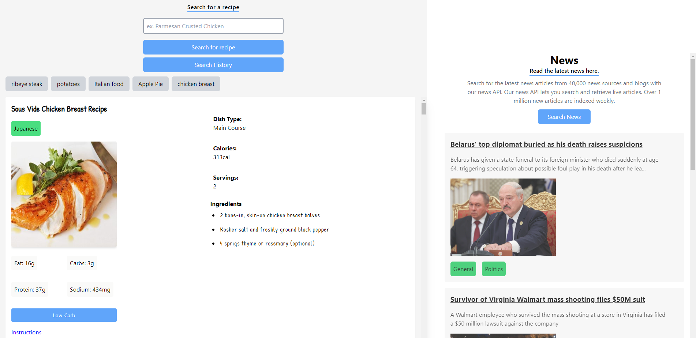

# Food and News


| Name | Status | Preview                  | Updated                |
| :--- | :----- |:-------------------------|:-----------------------|
| **Food & News** | ✅ Running  | [link to deployed app]() | Dec 22, 2022 at 1:41AM |





## Description

This web app lets users browse a selection of delicious recipes where they can view different nutritional facts and details about each recipe.

Users are also able to view the latest top stories news articles around the globe.

## User Stories

- [x] User can search a keyword or search for a recipe name.
- [x] User can view different recipes and nutritional facts about each recipe.
- [x] User can view a variety of details about each recipe, including the serving amount, cuisine type and dish type.
- [x] User can browse the latest and most current news articles.

## Technologies Used

- [x] JavaScript
- [x] Tailwind CSS
- [x] HTML5
- [x] Deployed on GitHub Pages
- [x] Edamam Recipe API endpoint
- [x] The News top stories API endpoint

## Usage

```
Enter a keyword for a recipe to see a list of different recipe results.
```

```
Click the search new button to get a list of current top stories around the world.
```

## Contributors

[Aaron S](https://github.com/A-Singh15/)

[Ramit S](https://github.com/ramitsingh447)


## Installation

```
clone the repo to local machine
```

```
cd food-and-news/
```

```
open live server on index.html
```
